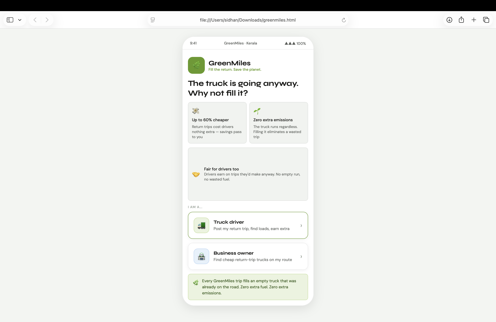
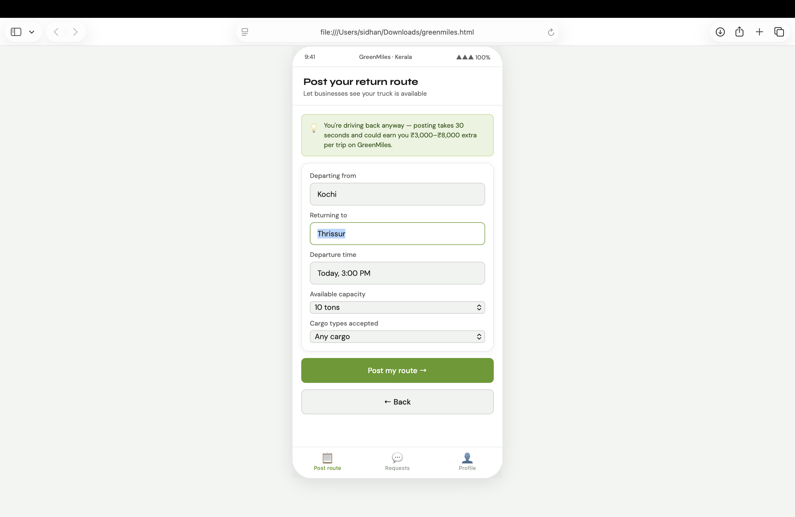
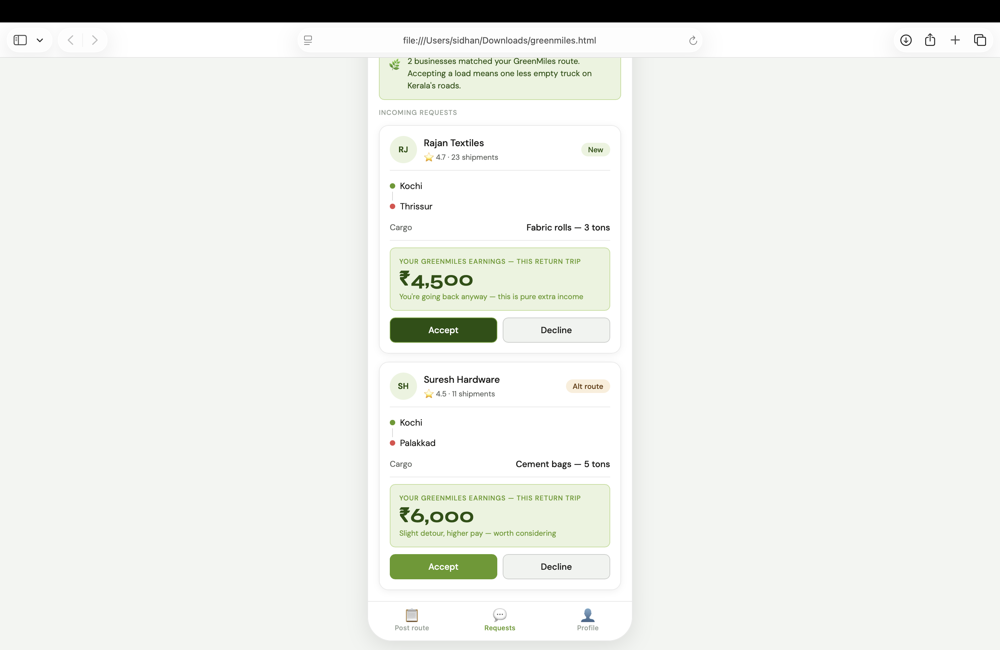
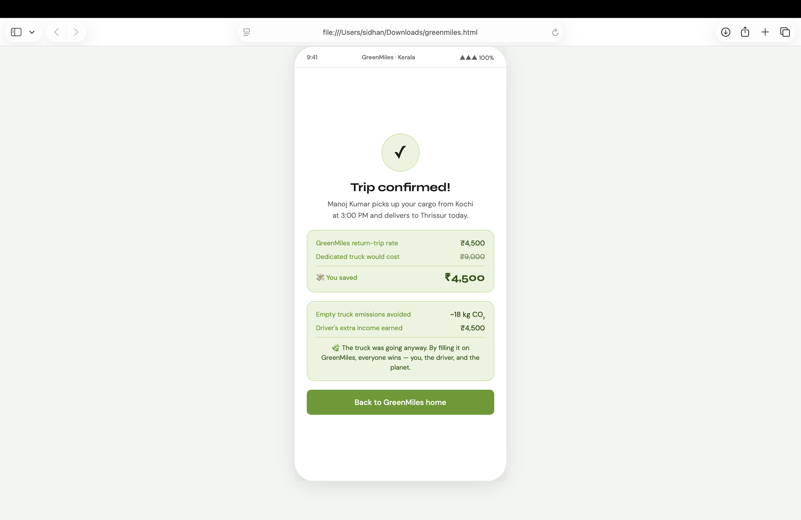

# Project Name
GreenMiles
## Problem Statement
Every day across Kerala, thousands of trucks complete a delivery and drive back completely empty. This means:

Businesses pay full price for a dedicated truck when a cheaper option was already heading their way
Drivers earn nothing on the return journey despite burning fuel
Empty trucks emit CO₂ for zero productive purpose — a waste that adds up fast


## Project Description
Fill the return. Save the planet.

GreenMiles is a mobile-first web app that connects local business owners with truck drivers returning empty after a delivery. Instead of driving back with nothing, drivers fill their truck with cargo going the same way — earning extra income on a trip they're already making. Businesses get reliable transport at up to 60% less than a dedicated truck. And because the truck is already on the road, every matched trip eliminates what would have been a completely wasted, polluting run.

A triple win — for businesses, drivers, and the environment.

---

## Google AI Usage
claude.ai
antigravity
gemini
- 

### How Google AI Was Used
coding
descibing the problem proffessionally

---

## Proof of Google AI Usage
Add proof of ai:
[AI Proof]/(antigravity screenshot.png)
---

## Screenshots 
Add project screenshots:

  




---

## Demo Video
Upload your demo video to Google Drive and paste the shareable link here(max 3 minutes).
[Watch Demo](#)

---

## Installation Steps

```bash
# Clone the repository
git clone <(https://github.com/sidhan048-eng/GreenMiless.git)>

# Go to project folder
cd GreenMiless

# Install dependencies
npm install

# Run the project
npm start
